# [Awesome Artistic Typography](http://arxiv.org/abs/2407.14774) [](https://github.com/sindresorhus/awesome) 


Welcome to Awesome-Artistic-Typography! This is a comprehensive list of artistic typography, including methods and datasets introduced for text stylization and semantic typography tasks. Further information are available in paper: [Intelligent Artistic Typography: A Comprehensive Review of Artistic Text Design and Generation.](http://arxiv.org/abs/2407.14774)


<p align="center">
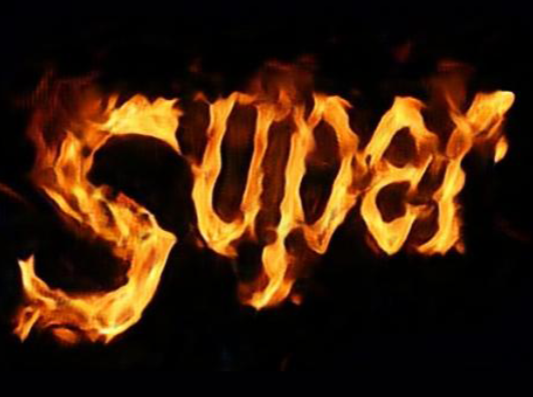  
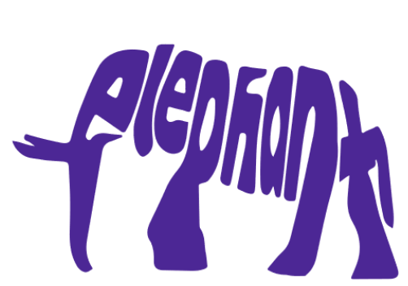  
</p>


<p align="center">


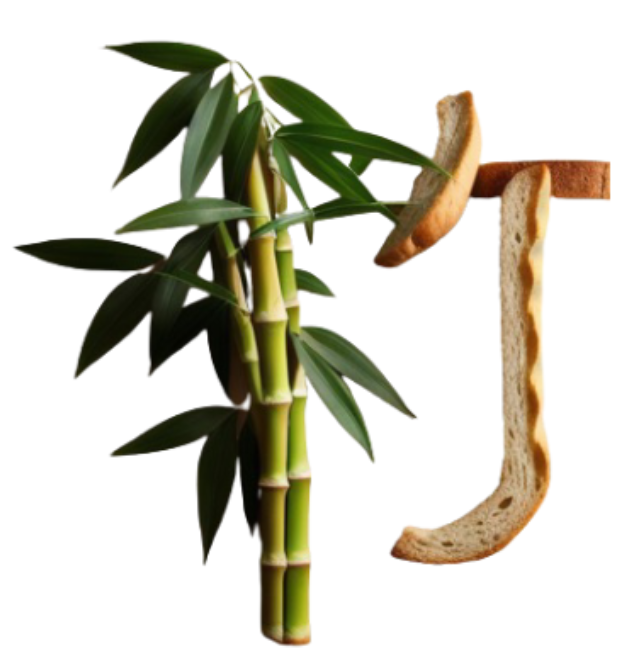
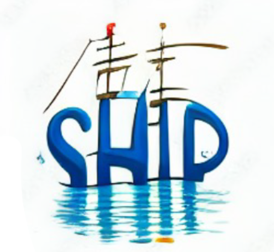
</p>


<p align="center">
(Source: <a href="https://openaccess.thecvf.com/content_ICCV_2019/html/Yang_Controllable_Artistic_Text_Style_Transfer_via_Shape-Matching_GAN_ICCV_2019_paper.html">Shape-Matching GAN</a>, <a href="https://dl.acm.org/doi/abs/10.1145/2897824.2925887">Zou et al.</a>, <a href="Anything to glyph: Artistic font synthesis via text-to-image diffusion model">Anything to Glyph</a>, <a href="http://openaccess.thecvf.com/content_CVPR_2019/html/Wang_Typography_With_Decor_Intelligent_Text_Style_Transfer_CVPR_2019_paper.html"> Typography With Decor </a>,
<a href="https://arxiv.org/abs/2310.18332">Wordart Designer</a> and <a href="https://openaccess.thecvf.com/content/ICCV2023/html/Tanveer_DS-Fusion_Artistic_Typography_via_Discriminated_and_Stylized_Diffusion_ICCV_2023_paper.html">DS-Fusion</a>)
</p>


## Table of Contents 


- [Artistic Text Stylization](#artistic-text-stylization)
  - [Static Artistic Text Stylization](#static-artistic-text-stylization)
    - [Text effect transfer](#text-effect-transfer)
    - [Arbitrary style transfer on text](#arbitrary-style-transfer-on-text)
    - [Joint artistic style and font style transfer](#joint-artistic-style-and-font-style-transfer)
  - [Dynamic Artistic Text Stylization](#dynamic-artistic-text-stylization)
    - [Dynamic text effect transfer](#dynamic-text-effect-transfer)
    - [Arbitrary dynamic style transfer on text](#arbitrary-dynamic-style-transfer-on-text)
- [Semantic Typography](#semantic-typography)
  - [Static Semantic Typography](#static-semantic-typography)
    - [Character-level semantic typography](#character-level-semantic-typography)
    - [Word-level semantic typography](#word-level-semantic-typography)
  - [Kinetic Typography](#kinetic-typography)
- [Datasets](#datasets)


# Artistic Text Stylization

## Static Artistic Text Stylization 

### Text effect transfer

<p align="center">
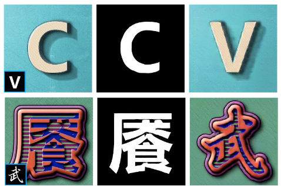
</p>
<p align="center">
(Source: <a href="https://ojs.aaai.org/index.php/AAAI/article/view/3919">TET-GAN</a>)
</p>


| Title | Method | Feature | Code | Pub. & Date
|:-----:|:-----:|:-----:|:-----:|:-----:|
|[Artistic Text Effect Transfer with Conditonal Generative Adversarial Network](https://ieeexplore.ieee.org/abstract/document/9852534)| GAN-based | simplified [TET-GAN](https://ojs.aaai.org/index.php/AAAI/article/view/3919) | - | CACML, 2022|
|[Text Style Transfer With Decorative Elements](https://ieeexplore.ieee.org/abstract/document/9565565)|  GAN-based |  decor transfer on Chinese characters | - | MIPR, 2021
|[Typography with decor: Intelligent text style transfer](http://openaccess.thecvf.com/content_CVPR_2019/html/Wang_Typography_With_Decor_Intelligent_Text_Style_Transfer_CVPR_2019_paper.html) |  GAN-based| decorative element (decor) transfer| [code](https://github.com/daooshee/Typography-with-Decor) | CVPR, 2019 |
|[TET-GAN: Text effects transfer via stylization and destylization](https://ojs.aaai.org/index.php/AAAI/article/view/3919)  | GAN-based | style-glyph disentanglement | [code](https://github.com/williamyang1991/TET-GAN) |AAAI, 2019 |
| [A Common Framework for Interactive Texture Transfer](https://openaccess.thecvf.com/content_cvpr_2018/html/Men_A_Common_Framework_CVPR_2018_paper.html) | GAN-based | versatile interactive texture transfer | [code](https://github.com/menyifang/CFITT) |CVPR, 2018 |
|[Awesome typography: StatisticsBased Text Effects Transfer](https://openaccess.thecvf.com/content_cvpr_2017/html/Yang_Awesome_Typography_Statistics-Based_CVPR_2017_paper.html) | patch-based|  distribution-aware text effect prior| [code](https://github.com/williamyang1991/Text-Effects-Transfer)  | CVPR, 2017 |
|[Texture transfer based on continuous structure of texture patches for design of artistic Shodo fonts](https://dl.acm.org/doi/abs/10.1145/1899950.1899968) |stroke-based|   Ink texture synthesis along strokes| -  | SIGGRAPH Asia, 2010 |

### Arbitrary style transfer on text

<p align="center">
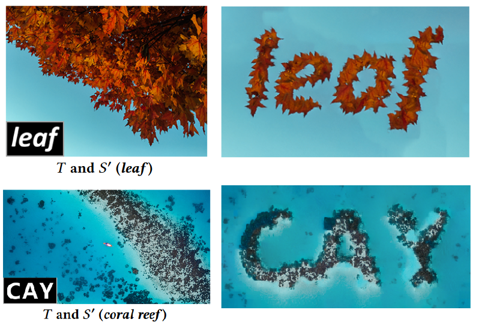
</p>
<p align="center">
(Source: <a href="https://dl.acm.org/doi/abs/10.1145/3240508.3240580">UT-Effect</a>)
</p>

| Title | Method | Feature | Code | Pub. & Date
|:-----:|:-----:|:-----:|:-----:|:-----:|
| [Anything to glyph: Artistic font synthesis via text-to-image diffusion model](https://dl.acm.org/doi/abs/10.1145/3610548.3618208) | diffusion-based | place objects according to the glyph | - | SIGGRAPH Asia, 2023 |
| [Intelligent Typography: Artistic Text Style Transfer for Complex Texture and Structure](https://ieeexplore.ieee.org/abstract/document/9906917) | GAN-based | coarse-to-fine complex style transfer | [code](https://github.com/WendongMao/Intelligent_Typography) | TMM, 2023|
| [An Art Font Generation Technique using Pix2Pix-based Networks](http://ww.bncss.org/index.php/bncss/article/view/161) | GAN-based | train a network to generate data | - | BNCSS, 2023|
| [Style transfer network for complex multi-stroke text](https://link.springer.com/article/10.1007/s00530-023-01047-4) | GAN-based  | clean edges by erosion and dilation | - | MS, 2023|
| [Improving Font Effect Generation based on Pyramid Style Feature](https://www.ijpe-online.com/EN/10.23940/ijpe.20.08.p14.12711278) | GAN-based  | clean edges by erosion and dilation | - | IJPE, 2020|
| [Controllable Artistic Text Style Transfer via Shape-Matching GAN](https://openaccess.thecvf.com/content_ICCV_2019/html/Yang_Controllable_Artistic_Text_Style_Transfer_via_Shape-Matching_GAN_ICCV_2019_paper.html) | GAN-based  | one-shot learning; style degree control | [code](https://github.com/VITA-Group/ShapeMatchingGAN) | ICCV, 2019|
| [Context-Aware Unsupervised Text Stylization](https://dl.acm.org/doi/abs/10.1145/3240508.3240580) | patch-based | structure transfer & texture transfer | - | ACM MM, 2018 |


### Joint artistic style and font style transfer
<p align="center">
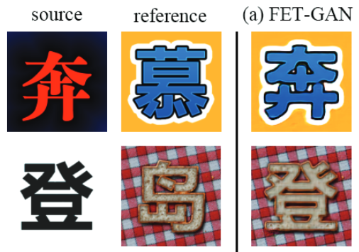
</p>
<p align="center">
(Source: <a href="https://ojs.aaai.org/index.php/AAAI/article/view/5535">FET-GAN</a>)
</p>

| Title | Method | Feature | Code | Pub. & Date
|:-----:|:-----:|:-----:|:-----:|:-----:|
| [Text style transfer based on multi-factor disentanglement and mixture](https://dl.acm.org/doi/abs/10.1145/3503161.3548239) | GAN-based | effect-font-glyph disentanglement | - | ACM MM, 2022 |
| [Gentext: Unsupervised artistic text generation via decoupled font and texture manipulation](https://arxiv.org/abs/2207.09649) | GAN-based | multi-task end-to-end training | - | July, 2022 |
| [Dse-net: Artistic font image synthesis via disentangled style encoding](https://ieeexplore.ieee.org/abstract/document/9859795) | GAN-based | effect-font-glyph disentanglement | [code](https://github.com/moonlight03/DSE-Net) | ICME, 2022|
| [Few-Shot Text Style Transfer via Deep Feature Similarity](https://ieeexplore.ieee.org/abstract/document/9098082) | GAN-based | weighted style representation | - | TIP, 2020 |
| [FET-GAN: Font and Effect Transfer via K-shot Adaptive Instance Normalization](https://ojs.aaai.org/index.php/AAAI/article/view/5535) | GAN-based | AdaIN-based text style modelling | [code](https://github.com/liweileev/FET-GAN) | AAAI, 2020 |
| [Art Font Image Generation with Conditional Generative Adversarial Networks](https://ieeexplore.ieee.org/abstract/document/9355842) | GAN-based | text edge and skeleton as auxiliary input | - | CACNDRW, 2020|
| [Artistic glyph image synthesis via one-stage few-shot learning](https://dl.acm.org/doi/abs/10.1145/3355089.3356574) | GAN-based | two parallel encoder-decoder branches | [code](https://github.com/hologerry/AGIS-Net) | ACM TOG, 2019 |
| [Neural Style Transfer for Characters Synthesis via Stack Network](https://web.archive.org/web/20220304205638id_/http://ajiips.com.au/papers/V16.2/v16n2_54-62.pdf) | GAN-based | coarse-to-fine cascaded stack network | - | ICONIP, 2019|
| [Multi-content gan for few-shot font style transfer](https://openaccess.thecvf.com/content_cvpr_2018/html/Azadi_Multi-Content_GAN_for_CVPR_2018_paper.html) | GAN-based | end-to-end stack network | [code](https://github.com/azadis/MC-GAN) | CVPR, 2018|


## Dynamic Artistic Text Stylization 
<p align="center">
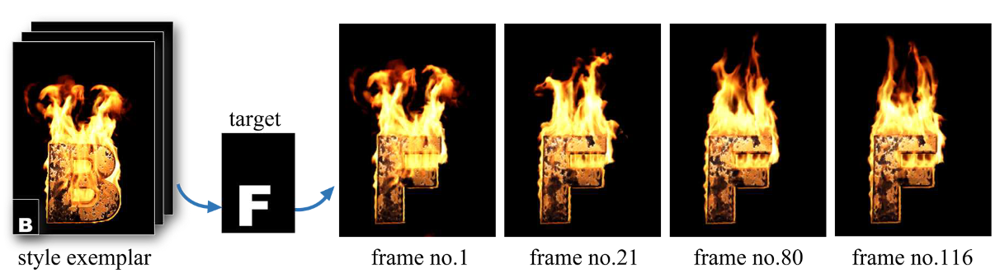
</p>
<p align="center">
(Source: <a href="https://openaccess.thecvf.com/content_CVPR_2019/html/Men_DynTypo_Example-Based_Dynamic_Text_Effects_Transfer_CVPR_2019_paper.html">DynTypo</a>)
</p>

### Dynamic text effect transfer

| Title | Method | Feature | Code | Pub. & Date
|:-----:|:-----:|:-----:|:-----:|:-----:|
| [Dynamic Texture Transfer using PatchMatch and Transformers](https://arxiv.org/abs/2402.00606)|patch & transformer-based| long-distance dependency modeling | - | Feb, 2024 |
| [DynTypo: Example-based Dynamic Text Effects Transfer](https://openaccess.thecvf.com/content_CVPR_2019/html/Men_DynTypo_Example-Based_Dynamic_Text_Effects_Transfer_CVPR_2019_paper.html)| patch-based | global NNF search across frames | [code](https://github.com/menyifang/DynTypo) | CVPR, 2019 |

### Arbitrary dynamic style transfer on text

| Title | Method | Feature | Code | Pub. & Date
|:-----:|:-----:|:-----:|:-----:|:-----:|
| [Shape-Matching GAN++: Scale Controllable Dynamic Artistic Text Style Transfer](https://ieeexplore.ieee.org/abstract/document/9339900)|GAN-based | spatial-temporal structural mappings | - | TPAMI, 2021 |


# Semantic Typography 

## Static Semantic Typography

### Character-level semantic typography
<p align="center">
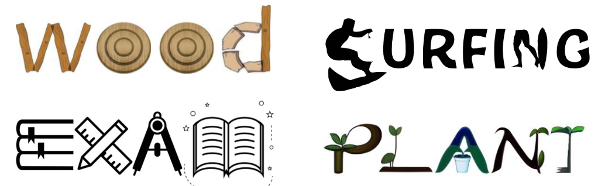
</p>
<p align="center">
(Source: <a href="https://onlinelibrary.wiley.com/doi/abs/10.1111/cgf.12785">Zhang et al.</a>，<a href="https://arxiv.org/abs/1903.07820">Trick or treat</a>，<a href="https://dl.acm.org/doi/abs/10.1145/3592123">Iluz et al.</a>, and <a href="https://openaccess.thecvf.com/content/ICCV2023/html/Tanveer_DS-Fusion_Artistic_Typography_via_Discriminated_and_Stylized_Diffusion_ICCV_2023_paper.html)">DS-Fusion</a>)
</p>

| Title | Method | Feature | Code | Pub. & Date
|:-----:|:-----:|:-----:|:-----:|:-----:|
| [WordArt Designer: User-Driven Artistic Typography Synthesis using Large Language Models](https://arxiv.org/abs/2310.18332)| LLM and diffusion-based | user-controllable artistic design | - | Nov, 2023 |
| [Ds-fusion: Artistic typography via discriminated and stylized diffusion](https://openaccess.thecvf.com/content/ICCV2023/html/Tanveer_DS-Fusion_Artistic_Typography_via_Discriminated_and_Stylized_Diffusion_ICCV_2023_paper.html)| diffusion-based | raster semantic feature enhancement | [code](https://github.com/tmaham/DS-Fusion) | ICCV, 2023 |
| [Word-as-image for semantic typography](https://dl.acm.org/doi/abs/10.1145/3592123)| diffusion-based | vector glyph shape deformation | [code](https://github.com/Shiriluz/Word-As-Image) | ACM TOG, 2023 |
| [Trick or treat: Thematic reinforcement for artistic typography](https://arxiv.org/abs/1903.07820)|retrieval-based |unsupervised autoencoder matching | [code](https://github.com/purvaten/treat) | Mar, 2019 |
| [Synthesizing Ornamental Typefaces](https://onlinelibrary.wiley.com/doi/abs/10.1111/cgf.12785)|retrieval-based |joint semantic and shape matching | - | CGF, 2017 |

### Word-level semantic typography
<p align="center">
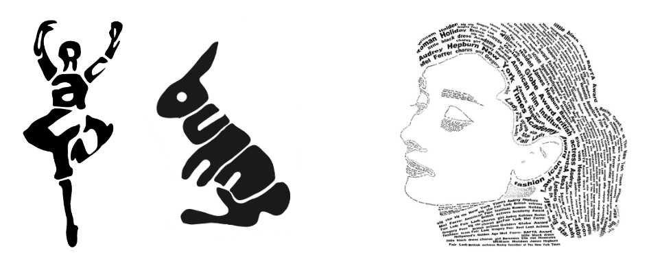
</p>
<p align="center">
(Source: <a href="https://dl.acm.org/doi/abs/10.1145/1268517.1268527">Xu et al.</a>，<a href="https://dl.acm.org/doi/abs/10.1145/2897824.2925887">Zou et al.</a>, and <a href="https://dl.acm.org/doi/abs/10.1145/3539610">Zhang et al.</a>)
</p>

| Title | Method | Feature | Code | Pub. & Date
|:-----:|:-----:|:-----:|:-----:|:-----:|
| [Creating Word Paintings Jointly Considering Semantics, Attention, and Aesthetics](https://dl.acm.org/doi/abs/10.1145/3539610)| vector field & SVM-based | visual saliency for aesthetic optimization | - | ACM TAP, 2022 |
| [Legible compact calligrams](https://dl.acm.org/doi/abs/10.1145/2897824.2925887)| warp-based|legibility enhanced calligram | - | ACM TOG, 2016 |
| [PicWords: Render a picture by packing keywords](https://ieeexplore.ieee.org/abstract/document/6737242)| warp-based | keyword semantic priority ranking | [code](https://github.com/amarjitjadhav/PicWords) | TMM, 2014 |
| [Digital Micrography](https://dl.acm.org/doi/abs/10.1145/2010324.1964995)| vector field-based | adaptive text layout synthesis | - | ACM TOG, 2011 |
| [Structure-based ASCII Art](https://dl.acm.org/doi/abs/10.1145/1833349.1778789)|structure-based | structural ASCII art generation| - | ACM SIGGRAPH, 2010 |
| [Calligraphic packing](https://dl.acm.org/doi/abs/10.1145/1268517.1268527)| warp-based | shape adaptive text warping | - | GL, 2007 |

## Kinetic Typography
<p align="center">
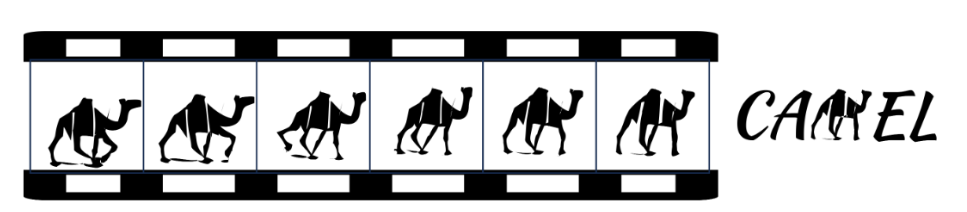
</p>
<p align="center">
(Source: <a href="https://arxiv.org/abs/2404.11614">Dynamic Typography</a>)
</p>

| Title | Method | Feature | Code | Pub. & Date
|:-----:|:-----:|:-----:|:-----:|:-----:|
| [Dynamic Typography: Bringing Text to Life via Video Diffusion Prior](https://arxiv.org/abs/2404.11614)| diffusion-based |character deformation and animation | [code](https://github.com/zliucz/animate-your-word) | Apr, 2024 |
| [Creating emordle: Animating word cloud for emotion expression](https://ieeexplore.ieee.org/abstract/document/10153659/)| frame-based | emotional word cloud animation | - | TVCG, 2023 |

# Datasets


| Name  |Type |Images|  Feature | Download | Pub. & Date |
|:-----:|:-----:|:-----:|:-----:|:-----:|:-----:|
|[AnyWord-3M](https://github.com/tyxsspa/AnyText?tab=readme-ov-file)|visual text|3,034,486|text images from several datasets 1.6 million in Chinese, 1.39 million in English, and 10k images in other languages.|[ModelScope](https://modelscope.cn/datasets/iic/AnyWord-3M/summary)|2024|
|[LAION-Glyph](https://github.com/AIGText/GlyphControl-release)|visual text|∼10,000,000|mages with rich visual text content|[Github](https://github.com/AIGText/GlyphControl-release)|2023|
|[MARIO-10M](https://github.com/microsoft/unilm/tree/master/textdiffuser-2)|visual text|10,061,720|9,194,613, 343,423 and 523,684 text images from natural images, posters, and book covers, respectively.|[Github](https://github.com/microsoft/unilm/tree/master/textdiffuser-2)|2023|
|[TextLogo3K](https://github.com/yizhiwang96/TextLogoLayout?tab=readme-ov-file)|text logo|3,470|text logo images extracted from poster/covers of movies, TV series and comics.|[Google Drive](https://drive.google.com/drive/folders/1FofGxAbpXp2Jjfz-mROsqwpOvL8SKpuE?usp=sharing)|2022|
|[SSAF-CN<br><br>SSAF-EN](https://moonlight03.github.io/DSE-Net/)|text effects|97,200<br><br>2,600|00 text effects rendered on 972 Chinese characters.<br><br>100 text effects rendered on 26 English letters.|[Google Drive](https://drive.google.com/file/d/1KsCmwg3yX0uAgjUe7rKJ8oYctIUO4LIz/view?usp=sharing)<br>[Baidu Pan](https://pan.baidu.com/share/init?surl=EFLGSkQ24WcYnZefWRIDyQ&pwd=4jom) (code: 4jom)|2022|
|[Imgur5K](https://github.com/facebookresearch/IMGUR5K-Handwriting-Dataset)|handwriting|135,375|135,375 handwritten English words from 5,305 images|[Github](https://github.com/facebookresearch/IMGUR5K-Handwriting-Dataset)|2021|
|[TE141K-E<br><br>TE141K-C<br><br>TE141K-S](https://daooshee.github.io/TE141K/)|text effects|66,196<br><br>54,405<br><br>20,480|64 text effects on 52 English letters of 19 fonts.<br><br>65 text effects rendered on 775 Chinese characters, 52 English letters and 10 Arabic numerals.<br><br>20 text effects rendered on 56 special symbols, and 968 letters in Japanese, Russian, etc.|[Google Drive](https://drive.google.com/drive/folders/1kTCzs425Ddi6BzTYzPPtz5ucD__tjuSU)<br>[Baidu Pan](https://pan.baidu.com/s/1o0SWr-Rg01lkii_F5ugJYg) (code: knzy)|2020|
|[TextEffects-Decor](https://daooshee.github.io/Typography2019/)|text effects|59,280|64 text effects with decorative elements rendered on 52 English letters of 19 fonts.|[Google Drive](https://drive.google.com/drive/u/0/folders/1eNYlxpGY7bU8nd36rlu12gkRTGSjxtKu)|2019|
|[TET-GAN](https://williamyang1991.github.io/projects/AAAI2019/TETGAN.html)|text effects|53,568|64 text effects rendered on 775 Chinese characters, 52 English letters and 10 Arabic numerals.|[Google Drive](https://drive.google.com/drive/folders/1NTVUWy099BIXuu2Y5mJUYxAxOZ96Qwnz?usp=sharing)<br>[Baidu Pan](https://pan.baidu.com/s/1e0OIPob9cKCqFua7PKzIRg)|2019|
|[AGIS-Net-C<br><br>AGIS-Net-P](https://github.com/hologerry/AGIS-Net?tab=readme-ov-file)|joint font & text effects|1,571,940<br><br>256,410|synthetic artistic Chinese characters<br><br>professional-designed artistic Chinese characters.|[Dropbox](https://www.dropbox.com/sh/76axfikky9m3r3a/AABZZ7Xw6rlRpt8A7lGw1yK9a?dl=0)<br>[MEGA](https://mega.nz/folder/35oTkZbK#yq6u4H8_eVWShaMO6asNLg)|2019|
| [MC-GAN-Gray<br><br>MC-GAN-Color](https://github.com/azadis/MC-GAN) |joint font & text effects |260,000<br><br>520,000| gray-scale english letter <br><br>colorful english letter| [Github](https://github.com/azadis/MC-GAN)| 2018 |


<!-- # Citation

If you find our work is useful in your research or applications, please consider giving us a star 🌟 and citing it by the following BibTeX entry.

```

``` -->
